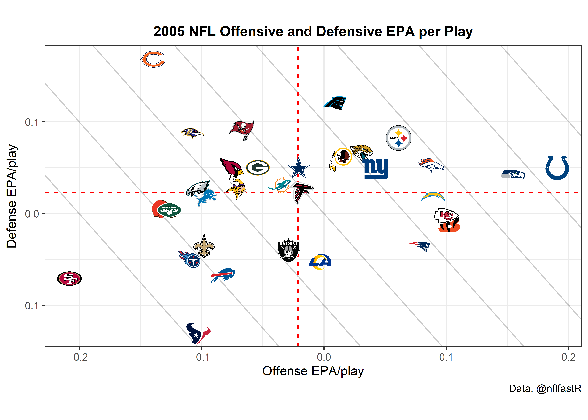

nflfastR 
================

<!-- badges: start --> 


[](https://twitter.com/nflfastR)
<!-- badges: end -->

  - [Installation](#installation)
  - [Usage](#usage)
      - [Example 1: replicate `nflscrapR` with
        `fast_scraper`](#example-1-replicate-nflscrapr-with-fast_scraper)
      - [Example 2: scrape a batch of games very quickly with
        `fast_scraper` and parallel
        processing](#example-2-scrape-a-batch-of-games-very-quickly-with-fast_scraper-and-parallel-processing)
      - [Example 3: completion percentage over expected
        (CPOE)](#example-3-completion-percentage-over-expected-cpoe)
      - [Example 4: using drive
        information](#example-4-using-drive-information)
      - [Example 5: Plot offensive and defensive EPA per play for a
        given
        season](#example-5-plot-offensive-and-defensive-epa-per-play-for-a-given-season)
      - [Example 6: Working with roster and position
        data](#example-6-working-with-roster-and-position-data)
  - [`nflfastR` models](#nflfastr-models)
  - [Data repository](#data-repository)
  - [About](#about)
  - [Special thanks](#special-thanks)

<!-- README.md is generated from README.Rmd. Please edit that file -->


`nflfastR` is a set of functions to efficiently scrape NFL play-by-play
data. `nflfastR` expands upon the features of nflscrapR:

  - The package contains NFL play-by-play data back to 1999
  - As suggested by the package name, it obtains games **much** faster
  - Includes completion probability (`cp`) and completion percentage
    over expected (`cpoe`) in play-by-play going back to 2006
  - Includes drive information, including drive starting position and
    drive result
  - Includes series information, including series number and series
    success
  - Hosts [a repository of play-by-play data going back
    to 1999](https://github.com/guga31bb/nflfastR-data) for very quick
    access

We owe a debt of gratitude to the original
[`nflscrapR`](https://github.com/maksimhorowitz/nflscrapR) team, Maksim
Horowitz, Ronald Yurko, and Samuel Ventura, without whose contributions
and inspiration this package would not exist.

## Installation

You can load and install nflfastR from [GitHub](https://github.com/)
with:

``` r
# If 'devtools' isn't installed run
# install.packages("devtools")

devtools::install_github("mrcaseb/nflfastR")
```

## Usage

``` r
library(nflfastR)
library(tidyverse)
```

### Example 1: replicate `nflscrapR` with `fast_scraper`

The functionality of `nflscrapR` can be duplicated by using
`fast_scraper` This obtains the same information contained in
`nflscrapR` (plus some extra) but much more quickly. To compare to
`nflscrapR`, we use their data repository as the program no longer
functions now that the NFL has taken down the old Gamecenter feed. Note
that EP differs from nflscrapR as we use a newer era-adjusted model
(more on this below).

This example also uses the built-in function `clean_pbp` to create a
‘name’ column for the primary player involved (the QB on pass play or
ball-carrier on run play).

``` r
read_csv(url('https://github.com/ryurko/nflscrapR-data/blob/master/play_by_play_data/regular_season/reg_pbp_2019.csv?raw=true')) %>%
  filter(home_team == 'SF' & away_team == 'SEA') %>%
  select(desc, play_type, ep, epa, home_wp) %>% head(5) %>% 
  knitr::kable(digits = 3)
```

| desc                                                                                                                | play\_type |      ep |     epa | home\_wp |
| :------------------------------------------------------------------------------------------------------------------ | :--------- | ------: | ------: | -------: |
| J.Myers kicks 65 yards from SEA 35 to end zone, Touchback.                                                          | kickoff    |   0.815 |   0.000 |       NA |
| (15:00) T.Coleman left guard to SF 26 for 1 yard (J.Clowney).                                                       | run        |   0.815 | \-0.606 |    0.500 |
| (14:19) T.Coleman right tackle to SF 25 for -1 yards (P.Ford).                                                      | run        |   0.209 | \-1.146 |    0.485 |
| (13:45) (Shotgun) J.Garoppolo pass short middle to K.Bourne to SF 41 for 16 yards (J.Taylor). Caught at SF39. 2-yac | pass       | \-0.937 |   3.223 |    0.453 |
| (12:58) PENALTY on SEA-J.Reed, Encroachment, 5 yards, enforced at SF 41 - No Play.                                  | no\_play   |   2.286 |   0.774 |    0.551 |

``` r
fast_scraper('2019_10_SEA_SF') %>%
  clean_pbp() %>%
  select(desc, play_type, ep, epa, home_wp, name) %>% head(6) %>% 
  knitr::kable(digits = 3)
```

| desc                                                                                                                         | play\_type |    ep |     epa | home\_wp | name        |
| :--------------------------------------------------------------------------------------------------------------------------- | :--------- | ----: | ------: | -------: | :---------- |
| GAME                                                                                                                         | NA         |    NA |      NA |       NA | NA          |
| 5-J.Myers kicks 65 yards from SEA 35 to end zone, Touchback.                                                                 | kickoff    | 1.483 |   0.000 |    0.560 | NA          |
| (15:00) 26-T.Coleman left guard to SF 26 for 1 yard (90-J.Clowney).                                                          | run        | 1.483 | \-0.581 |    0.560 | T.Coleman   |
| (14:19) 26-T.Coleman right tackle to SF 25 for -1 yards (97-P.Ford).                                                         | run        | 0.903 | \-0.810 |    0.543 | T.Coleman   |
| (13:45) (Shotgun) 10-J.Garoppolo pass short middle to 84-K.Bourne to SF 41 for 16 yards (24-J.Taylor). Caught at SF39. 2-yac | pass       | 0.092 |   2.349 |    0.506 | J.Garoppolo |
| (12:58) PENALTY on SEA-91-J.Reed, Encroachment, 5 yards, enforced at SF 41 - No Play.                                        | no\_play   | 2.441 |   0.820 |    0.591 | NA          |

### Example 2: scrape a batch of games very quickly with `fast_scraper` and parallel processing

This is a demonstration of `nflfastR`’s capabilities. While `nflfastR`
can scrape a batch of games very quickly, **please be respectful of
Github’s servers and use the [data
repository](https://github.com/guga31bb/nflfastR-data) which hosts all
the scraped and cleaned data** whenever possible. The only reason to
ever actually use the scraper is if it’s in the middle of the season and
we haven’t updated the repository with recent games (but we will try to
keep it updated).

``` r
#get list of some games from 2019
games_2019 <- fast_scraper_schedules(2019) %>% head(10) %>% pull(game_id)

tictoc::tic(glue::glue('{length(games_2019)} games with nflfastR:'))
f <- fast_scraper(games_2019, pp = TRUE)
tictoc::toc()
#> 10 games with nflfastR:: 14.46 sec elapsed
```

### Example 3: completion percentage over expected (CPOE)

Let’s look at CPOE leaders from the 2009 regular season.

As discussed above, `nflfastR` has a data repository for old seasons, so
there’s no need to actually scrape them. Let’s use that here (the below
reads .rds files, but .csv is also available).

``` r
tictoc::tic('loading all games from 2009')
games_2009 <- readRDS(url('https://raw.githubusercontent.com/guga31bb/nflfastR-data/master/data/play_by_play_2009.rds')) %>% filter(season_type == 'REG')
tictoc::toc()
#> loading all games from 2009: 2.8 sec elapsed
games_2009 %>% filter(!is.na(cpoe)) %>% group_by(passer_player_name) %>%
  summarize(cpoe = mean(cpoe), Atts=n()) %>%
  filter(Atts > 200) %>%
  arrange(-cpoe) %>%
  head(5) %>% 
  knitr::kable(digits = 1)
```

| passer\_player\_name | cpoe | Atts |
| :------------------- | ---: | ---: |
| D.Brees              |  7.4 |  509 |
| P.Manning            |  6.7 |  569 |
| P.Rivers             |  6.6 |  474 |
| B.Favre              |  6.0 |  527 |
| M.Schaub             |  5.3 |  571 |

### Example 4: using drive information

When scraping from the default RS feed, drive results are automatically
included. Let’s look at how much more likely teams were to score
starting from 1st & 10 at their own 20 yard line in 2015 (the last year
before touchbacks on kickoffs changed to the 25) than in 2000.

``` r
games_2000 <- readRDS(url('https://raw.githubusercontent.com/guga31bb/nflfastR-data/master/data/play_by_play_2000.rds'))
games_2015 <- readRDS(url('https://raw.githubusercontent.com/guga31bb/nflfastR-data/master/data/play_by_play_2015.rds'))

pbp <- bind_rows(games_2000, games_2015)

pbp %>% filter(season_type == 'REG' & down == 1 & ydstogo == 10 & yardline_100 == 80) %>%
  mutate(drive_score = if_else(drive_end_transition %in% c("Touchdown", "Field Goal", "TOUCHDOWN", "FIELD_GOAL"), 1, 0)) %>%
  group_by(season) %>%
  summarize(drive_score = mean(drive_score)) %>% 
  knitr::kable(digits = 3)
```

| season | drive\_score |
| -----: | -----------: |
|   2000 |        0.234 |
|   2015 |        0.305 |

So about 23% of 1st & 10 plays from teams’ own 20 would see the drive
end up in a score in 2000, compared to 30% in 2015. This has
implications for EPA models (see below).

### Example 5: Plot offensive and defensive EPA per play for a given season

Let’s build the NFL team tiers using offensive and defensive expected
points added per play for the 2005 regular season. The logo urls of the
espn logos are integrated into the ‘team\_colors\_logos’ data frame
which is delivered with the package.

Let’s also use the included helper function `clean_pbp`, which creates
“rush” and “pass” columns that (a) properly count sacks and scrambles
as pass plays and (b) properly include plays with penalties. Using this,
we can keep only rush or pass plays.

``` r
library(ggimage)
pbp <- readRDS(url('https://raw.githubusercontent.com/guga31bb/nflfastR-data/master/data/play_by_play_2005.rds')) %>%
  filter(season_type == 'REG') %>% filter(!is.na(posteam) & (rush == 1 | pass == 1))
offense <- pbp %>% group_by(posteam) %>% summarise(off_epa = mean(epa, na.rm = TRUE))
defense <- pbp %>% group_by(defteam) %>% summarise(def_epa = mean(epa, na.rm = TRUE))
logos <- teams_colors_logos %>% select(team_abbr, team_logo_espn)

offense %>%
  inner_join(defense, by = c("posteam" = "defteam")) %>%
  inner_join(logos, by = c("posteam" = "team_abbr")) %>%
  ggplot(aes(x = off_epa, y = def_epa)) +
  geom_abline(slope = -1.5, intercept = c(.4, .3, .2, .1, 0, -.1, -.2, -.3), alpha = .2) +
  geom_hline(aes(yintercept = mean(off_epa)), color = "red", linetype = "dashed") +
  geom_vline(aes(xintercept = mean(def_epa)), color = "red", linetype = "dashed") +
  geom_image(aes(image = team_logo_espn), size = 0.05, asp = 16 / 9) +
  labs(
    x = "Offense EPA/play",
    y = "Defense EPA/play",
    caption = "Data: @nflfastR",
    title = "2005 NFL Offensive and Defensive EPA per Play"
  ) +
  theme_bw() +
  theme(
    aspect.ratio = 9 / 16,
    plot.title = element_text(size = 12, hjust = 0.5, face = "bold")
  ) +
  scale_y_reverse()
```



### Example 6: Working with roster and position data

This section used to contain an example of working with roster data.
Unfortunately, we have not found a way to obtain roster data that can be
joined to the new play by play, so for now, it is empty. We would like
to be able to get position data but haven’t yet.

The `clean_pbp()` function does a lot of work cleaning up player names
and IDs for the purpose of joining them to roster data, but we do not
have any roster data to join to. **Note that player IDs are inconsistent
between the old (1999-2010) and new (2011 - present) data sources so use
IDs with caution**. Unfortunately there is nothing we can do about this
as the NFL changed their system for IDs in the underlying data.

## `nflfastR` models

`nflfastR` uses its own models for Expected Points, Win Probability, and
Completion Probability. To read about the models, [please see
here](https://github.com/mrcaseb/nflfastR/blob/master/data-raw/MODEL-README.md).
For a more detailed description of Expected Points models, we highly
recommend this paper [from the nflscrapR team located
here](https://arxiv.org/pdf/1802.00998.pdf).

`nflfastR` includes two win probability models: one with and one without
incorporating the pre-game spread.

``` r
fast_scraper('2019_03_NYJ_NE') %>%
  select(desc, spread_line, home_wp, vegas_home_wp) %>% 
  head(5) %>%
  knitr::kable(digits = 3)
```

| desc                                                                                             | spread\_line | home\_wp | vegas\_home\_wp |
| :----------------------------------------------------------------------------------------------- | -----------: | -------: | --------------: |
| GAME                                                                                             |         20.5 |       NA |              NA |
| 3-S.Gostkowski kicks 65 yards from NE 35 to end zone, Touchback.                                 |         20.5 |    0.563 |           0.858 |
| (15:00) 26-L.Bell up the middle to NYJ 32 for 7 yards (71-D.Shelton; 93-L.Guy).                  |         20.5 |    0.563 |           0.858 |
| (14:29) 8-L.Falk pass short right to 82-J.Crowder pushed ob at NYJ 47 for 15 yards (31-J.Jones). |         20.5 |    0.552 |           0.876 |
| (13:59) 26-L.Bell up the middle to NYJ 48 for 1 yard (54-D.Hightower, 55-J.Simon).               |         20.5 |    0.516 |           0.780 |

Because the Patriots were favored by 20.5 points in this Week 3
Jets-Patriots game, the naive (no-spread) and spread win probabilities
differ dramatically. In the no-spread model, `home_wp` begins at 0.56
(greater than 0.50 because home team advantage is included in the model)
and `vegas_home_wp` is 0.858. We have also included `vegas_wp` which is
the win probability of the possession team, incorporating the spread.

## Data repository

Even though `nflfastR` is very fast, **for historical games we recommend
downloading the data from
[here](https://github.com/guga31bb/nflfastR-data) as in Examples 4 and 5
above**. These data sets include play-by-play data of complete seasons
going back to 1999 and we will update them in 2020 once the season
starts. The files contain both regular season and postseason data, and
one can use game\_type or week to figure out which games occurred in the
postseason. Data are available as .csv.gz, .parquet, or .rds.

## About

`nflfastR` was developed by [Sebastian
Carl](https://twitter.com/mrcaseb) and [Ben
Baldwin](https://twitter.com/benbbaldwin).

## Special thanks

  - To [Nick Shoemaker](https://twitter.com/WeightRoomShoe) for [finding
    and making available JSON-formatted NFL play-by-play back
    to 1999](https://github.com/CroppedClamp/nfl_pbps) (`nflfastR` uses
    this source for 1999-2010)
  - To [Lau Sze Yui](https://twitter.com/903124S) for developing a
    scraping function to access JSON-formatted NFL play-by-play
    beginning in 2011.
  - To [Lee Sharpe](https://twitter.com/LeeSharpeNFL) for curating a
    resource for game information
  - To [Timo Riske](https://twitter.com/PFF_Moo), [Lau Sze
    Yui](https://twitter.com/903124S), [Sean
    Clement](https://twitter.com/SeanfromSeabeck), and [Daniel
    Houston](https://twitter.com/CowboysStats) for many helpful
    discussions regarding the development of the new `nflfastR` models
  - To [Zach Feldman](https://twitter.com/ZachFeldman3) and [Josh
    Hermsmeyer](https://twitter.com/friscojosh) for many helpful
    discussions about CPOE models as well as [Peter
    Owen](https://twitter.com/JSmoovesBrekkie) for [many helpful
    suggestions for the CP
    model](https://twitter.com/JSmoovesBrekkie/status/1268885950626623490)
  - To [Florian Schmitt](https://twitter.com/Flosch1006) for the logo
    design
  - The many users who found and reported bugs in `nflfastR` 1.0
  - And of course, the original
    [`nflscrapR`](https://github.com/maksimhorowitz/nflscrapR) team,
    Maksim Horowitz, Ronald Yurko, and Samuel Ventura, whose work
    represented a dramatic step forward for the state of public NFL
    research
