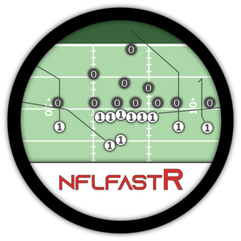

<!-- README.md is generated from README.Rmd. Please edit that file -->

# **nflfastR** 

<!-- badges: start -->


[](https://twitter.com/nflfastR)
<!-- badges: end -->

`nflfastR` is a set of functions to efficiently scrape NFL play-by-play
data. `nflfastR` expands upon the features of nflscrapR:

  - The package contains NFL play-by-play data back to 1999
  - As suggested by the package name, it obtains games **much** faster
  - Includes completion probability (`cp`) and completion percentage
    over expected (`cpoe`) in play-by-play going back to 2006
  - Includes drive information, including drive starting position and
    drive result
  - Includes series information, including series number and series
    success
  - Hosts [a repository of play-by-play data going back
    to 1999](https://github.com/guga31bb/nflfastR-data) for very quick
    access
  - Features new and enhanced models for Expected Points, Win
    Probability, and Completion Probability (see section below)

We owe a debt of gratitude to the original
[`nflscrapR`](https://github.com/maksimhorowitz/nflscrapR) team, Maksim
Horowitz, Ronald Yurko, and Samuel Ventura, without whose contributions
and inspiration this package would not exist.

## Installation

You can load and install nflfastR from
[GitHub](https://github.com/mrcaseb/nflfastR/) with:

``` r
# If 'devtools' isn't installed run
# install.packages("devtools")

devtools::install_github("mrcaseb/nflfastR")
```

## Usage

We have provided some application examples under `vignette("examples")`.
However, these require a basic knowledge of R. For this reason we have
the **nflfastR beginner’s guide** in `vignette("beginners_guide")`,
which we recommend to all those who are looking for an introduction to
nflfastR with R.

## Data repository

Even though `nflfastR` is very fast, **for historical games we recommend
downloading the data from
[here](https://github.com/guga31bb/nflfastR-data)**. These data sets
include play-by-play data of complete seasons going back to 1999 and we
will update them in 2020 once the season starts. The files contain both
regular season and postseason data, and one can use game\_type or week
to figure out which games occurred in the postseason. Data are available
as .csv.gz, .parquet, or .rds.

## nflfastR models

`nflfastR` uses its own models for Expected Points, Win Probability, and
Completion Probability. To read about the models, please see
`vignette("nflfastR-models")`. For a more detailed description of
Expected Points models, we highly recommend this paper [from the
nflscrapR team located here](https://arxiv.org/pdf/1802.00998.pdf).

`nflfastR` includes two win probability models: one with and one without
incorporating the pre-game spread.

## Special thanks

  - To [Nick Shoemaker](https://twitter.com/WeightRoomShoe) for [finding
    and making available JSON-formatted NFL play-by-play back
    to 1999](https://github.com/CroppedClamp/nfl_pbps) (`nflfastR` uses
    this source for 1999-2010)
  - To [Lau Sze Yui](https://twitter.com/903124S) for developing a
    scraping function to access JSON-formatted NFL play-by-play
    beginning in 2011.
  - To [Lee Sharpe](https://twitter.com/LeeSharpeNFL) for curating a
    resource for game information
  - To [Timo Riske](https://twitter.com/PFF_Moo), [Lau Sze
    Yui](https://twitter.com/903124S), [Sean
    Clement](https://twitter.com/SeanfromSeabeck), and [Daniel
    Houston](https://twitter.com/CowboysStats) for many helpful
    discussions regarding the development of the new `nflfastR` models
  - To [Zach Feldman](https://twitter.com/ZachFeldman3) and [Josh
    Hermsmeyer](https://twitter.com/friscojosh) for many helpful
    discussions about CPOE models as well as [Peter
    Owen](https://twitter.com/JSmoovesBrekkie) for [many helpful
    suggestions for the CP
    model](https://twitter.com/JSmoovesBrekkie/status/1268885950626623490)
  - To [Florian Schmitt](https://twitter.com/Flosch1006) for the logo
    design
  - The many users who found and reported bugs in `nflfastR` 1.0
  - And of course, the original
    [`nflscrapR`](https://github.com/maksimhorowitz/nflscrapR) team,
    Maksim Horowitz, Ronald Yurko, and Samuel Ventura, whose work
    represented a dramatic step forward for the state of public NFL
    research
