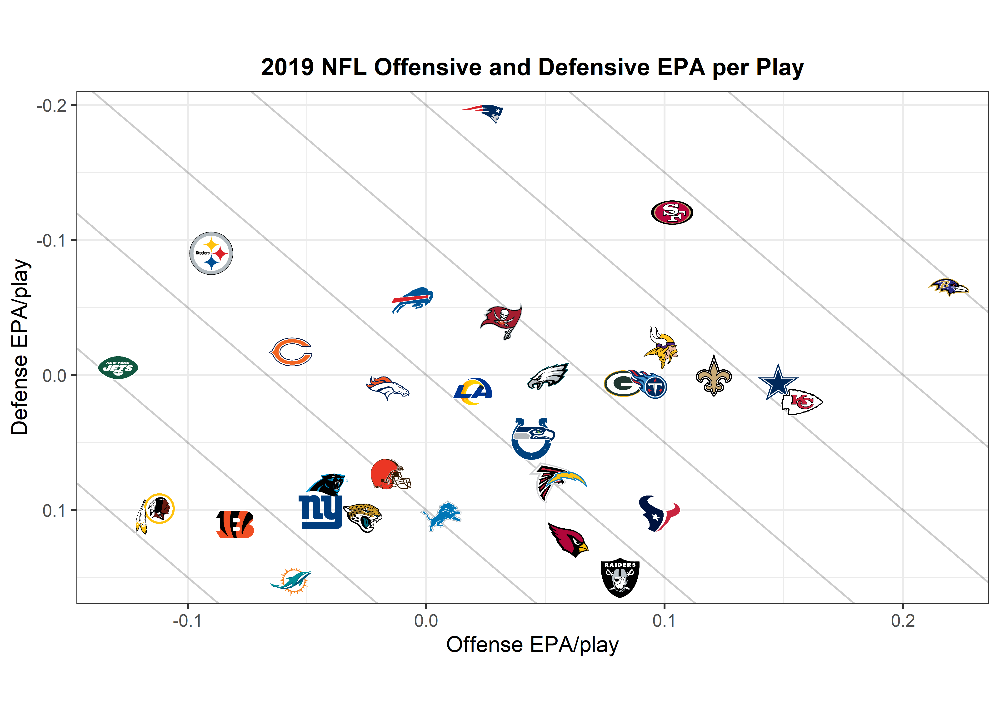

nflfastR 
================

  - [Installation](#installation)
  - [Usage](#usage)
      - [Example 1: replicate `nflscrapR` with
        `fast_scraper`](#example-1-replicate-nflscrapr-with-fast_scraper)
      - [Example 2: scrape a batch of games very quickly with
        `fast_scraper` and parallel
        processing](#example-2-scrape-a-batch-of-games-very-quickly-with-fast_scraper-and-parallel-processing)
      - [Example 3: completion percentage over expected
        (CPOE)](#example-3-completion-percentage-over-expected-cpoe)
      - [Example 4: using drive
        information](#example-4-using-drive-information)
      - [Example 5: scrape rosters with
        `fast_scraper_roster`](#example-5-scrape-rosters-with-fast_scraper_roster)
      - [Example 6: scrape highlight clips with
        `fast_scraper_clips`](#example-6-scrape-highlight-clips-with-fast_scraper_clips)
      - [Example 7: Plot offensive and defensive EPA per play for a
        given
        season](#example-7-plot-offensive-and-defensive-epa-per-play-for-a-given-season)
  - [More information](#more-information)
  - [Data repository](#data-repository)
  - [About](#about)

<!-- README.md is generated from README.Rmd. Please edit that file -->

<!-- badges: start -->

<!-- badges: end -->

`nflfastR` is a set of functions to efficiently scrape NFL play-by-play
and roster data. `nflfastR` expands upon the features of nflscrapR:

  - By incorporating the NFL’s RS feed, the package currently supports
    full play-by-play back to 2000
  - As suggested by the package name, it scrapes games **much** faster
  - Includes completion probability (`cp`) and completion percentage
    over expected (`cpoe`) in play-by-play going back to 2006
  - The default RS feed includes drive information, including drive
    starting position and drive result
  - Includes fast functions for roster and highlight scraping
  - Hosts [a repository of play-by-play data going back
    to 2000](https://github.com/guga31bb/nflfastR-data) for very quick
    access

We owe a debt of gratitude to the original
[`nflscrapR`](https://github.com/maksimhorowitz/nflscrapR) team, Maksim
Horowitz, Ronald Yurko, and Samuel Ventura, without whose contributions
and inspiration this package would not exist.

## Installation

You can load and install nflfastR from [GitHub](https://github.com/)
with:

``` r
# If 'devtools' isn't installed run
# install.packages("devtools")

# If 'nflscrapR' isn't installed run
# devtools::install_github("maksimhorowitz/nflscrapR")
devtools::install_github("mrcaseb/nflfastR")
```

## Usage

### Example 1: replicate `nflscrapR` with `fast_scraper`

The functionality of `nflscrapR` can be duplicated by using
`fast_scraper` with the ‘gc’ (for Gamecenter) option specified. This
scrapes from the same source as `nflscrapR` but much more quickly.

Reasons to use the `source = "gc"` option include (a) duplicating the
output of `nflscrapR` or (b) when scraping a live or recently-completed
game: Gamecenter updates live and the RS feed does not. For scraping old
seasons, we recommend not specifying a source option and letting the
scraper default to the RS feed (see Example 2 below).

This example also uses the built-in function `clean_pbp` to create a
"name’ column for the primary player involved (the QB on pass play or
ball-carrier on run play).

``` r
library(nflfastR)
library(tidyverse)
library(nflscrapR)

gameId <- 2019111100
nflscrapR::scrape_json_play_by_play(gameId) %>%
  select(desc, play_type, epa, home_wp) %>% head(5) %>% 
  knitr::kable(digits = 3)
```

| desc                                                                                                                | play\_type |     epa | home\_wp |
| :------------------------------------------------------------------------------------------------------------------ | :--------- | ------: | -------: |
| J.Myers kicks 65 yards from SEA 35 to end zone, Touchback.                                                          | kickoff    |   0.000 |       NA |
| (15:00) T.Coleman left guard to SF 26 for 1 yard (J.Clowney).                                                       | run        | \-0.606 |    0.500 |
| (14:19) T.Coleman right tackle to SF 25 for -1 yards (P.Ford).                                                      | run        | \-1.146 |    0.485 |
| (13:45) (Shotgun) J.Garoppolo pass short middle to K.Bourne to SF 41 for 16 yards (J.Taylor). Caught at SF39. 2-yac | pass       |   3.223 |    0.453 |
| (12:58) PENALTY on SEA-J.Reed, Encroachment, 5 yards, enforced at SF 41 - No Play.                                  | no\_play   |   0.774 |    0.551 |

``` r
#The 'gc' option specifies scraping gamecenter like nflscrapR does, as opposed to 'rs'
fast_scraper(gameId, source = "gc") %>%
  clean_pbp() %>%
  select(desc, play_type, epa, home_wp, name) %>% head(5) %>% 
  knitr::kable(digits = 3)
```

| desc                                                                                                                | play\_type |     epa | home\_wp | name        |
| :------------------------------------------------------------------------------------------------------------------ | :--------- | ------: | -------: | :---------- |
| J.Myers kicks 65 yards from SEA 35 to end zone, Touchback.                                                          | kickoff    |   0.000 |       NA | NA          |
| (15:00) T.Coleman left guard to SF 26 for 1 yard (J.Clowney).                                                       | run        | \-0.606 |    0.500 | T.Coleman   |
| (14:19) T.Coleman right tackle to SF 25 for -1 yards (P.Ford).                                                      | run        | \-1.146 |    0.485 | T.Coleman   |
| (13:45) (Shotgun) J.Garoppolo pass short middle to K.Bourne to SF 41 for 16 yards (J.Taylor). Caught at SF39. 2-yac | pass       |   3.223 |    0.453 | J.Garoppolo |
| (12:58) PENALTY on SEA-J.Reed, Encroachment, 5 yards, enforced at SF 41 - No Play.                                  | no\_play   |   0.774 |    0.551 | NA          |

### Example 2: scrape a batch of games very quickly with `fast_scraper` and parallel processing

``` r
#get list of some games from 2019
games_2019 <- fast_scraper_schedules(2019) %>% filter(game_type == 'REG') %>% head(16) %>% pull(game_id)

tictoc::tic(glue::glue('{length(games_2019)} games with nflfastR:'))
f <- fast_scraper(games_2019, pp = TRUE)
tictoc::toc()
#> 16 games with nflfastR:: 16.27 sec elapsed
tictoc::tic(glue::glue('{length(games_2019)} games with nflscrapR:'))
n <- map_df(games_2019, nflscrapR::scrape_json_play_by_play)
tictoc::toc()
#> 16 games with nflscrapR:: 441.1 sec elapsed
```

### Example 3: completion percentage over expected (CPOE)

Let’s look at CPOE leaders from the 2009 regular
season.

``` r
games <- fast_scraper_schedules(2009) %>% filter(game_type == 'REG') %>% pull(game_id)
tictoc::tic('scraping all 256 games from 2009')
games_2009 <- fast_scraper(games, pp = TRUE)
tictoc::toc()
#> scraping all 256 games from 2009: 126.16 sec elapsed
games_2009 %>% filter(!is.na(cpoe)) %>% group_by(passer_player_name) %>%
  summarize(cpoe = mean(cpoe), Atts=n()) %>%
  filter(Atts > 200) %>%
  arrange(-cpoe) %>%
  head(5) %>% 
  knitr::kable(digits = 1)
```

| passer\_player\_name | cpoe | Atts |
| :------------------- | ---: | ---: |
| D.Brees              |  9.3 |  509 |
| P.Manning            |  7.4 |  569 |
| B.Favre              |  6.6 |  526 |
| P.Rivers             |  6.2 |  475 |
| B.Roethlisberger     |  5.7 |  503 |

### Example 4: using drive information

When scraping from the default RS feed, drive results are automatically
included. Let’s look at how much more likely teams were to score
starting from 1st & 10 at their own 20 yard line in 2015 (the last year
before touchbacks on kickoffs changed to the 25) than in 2006.

`nflfastR` has a data repository for old seasons, so there’s no need to
actually scrape them. Let’s use that here (the below reads .rds files,
but .csv is also
available).

``` r
games_2000 <- readRDS(url('https://raw.githubusercontent.com/guga31bb/nflfastR-data/master/data/play_by_play_2000.rds'))
games_2015 <-readRDS(url('https://raw.githubusercontent.com/guga31bb/nflfastR-data/master/data/play_by_play_2015.rds'))

pbp <- rbind(games_2000, games_2015)

pbp %>% filter(game_type == 'REG' & down == 1 & ydstogo == 10 & yardline_100 == 80) %>%
  mutate(drive_score = if_else(drive_how_ended %in% c("Touchdown", "Field_Goal"), 1, 0)) %>%
  group_by(season) %>%
  summarize(drive_score = mean(drive_score)) %>% 
  knitr::kable(digits = 3)
```

| season | drive\_score |
| -----: | -----------: |
|   2000 |        0.233 |
|   2015 |        0.305 |

So about 23% of 1st & 10 plays from teams’ own 20 would see the drive
end up in a score in 2000, compared to 30% in 2015. This has
implications for EPA models (see
below).

### Example 5: scrape rosters with `fast_scraper_roster`

``` r
# Roster of Steelers and Seahawks in 2016 & 2019 using parallel processing
# teams_colors_logos is included in the package
team_ids <- teams_colors_logos %>% filter(team_abbr %in% c("SEA", "PIT")) %>% pull(team_id)
fast_scraper_roster(team_ids, c("2016", "2019"), pp = TRUE) %>% 
  select(2,9:13) %>% head() %>%
  knitr::kable()
```

| teamPlayers.displayName | teamPlayers.position | teamPlayers.nflId | teamPlayers.esbId | teamPlayers.gsisId | teamPlayers.birthDate |
| :---------------------- | :------------------- | ----------------: | :---------------- | :----------------- | :-------------------- |
| Shamarko Thomas         | SS                   |           2539937 | THO379701         | 00-0030412         | 02/23/1991            |
| Sean Davis              | SS                   |           2555386 | DAV746549         | 00-0033053         | 10/23/1993            |
| Javon Hargrave          | NT                   |           2555239 | HAR143881         | 00-0033109         | 02/07/1993            |
| Mike Hilton             | DB                   |           2556559 | HIL796239         | 00-0032521         | 03/09/1994            |
| Shaquille Riddick       | LB                   |           2552584 | RID186261         | 00-0032111         | 03/12/1993            |
| Ricardo Mathews         | DE                   |           1037901 | MAT188704         | 00-0027829         | 07/30/1987            |

### Example 6: scrape highlight clips with `fast_scraper_clips`

``` r
#use same week 1 games from above
vids <- fast_scraper_clips(games_2019)
vids %>% select(highlight_video_url) %>% head(2) %>% knitr::kable()
```

| highlight\_video\_url                                                                                                              |
| :--------------------------------------------------------------------------------------------------------------------------------- |
| <http://www.nfl.com/videos/nfl-game-highlights/0ap3000001051313/Bears-down-Rodgers-for-third-down-sack-on-Packers-opening-drive>   |
| <http://www.nfl.com/videos/nfl-game-highlights/0ap3000001051320/Khalil-Mack-Leonard-Floyd-swarm-Aaron-Rodgers-for-third-down-sack> |

### Example 7: Plot offensive and defensive EPA per play for a given season

Let’s build the NFL team tiers using offensive and defensive expected
points added per play for the 2005 regular season. The logo urls of the
espn logos are integrated into the ‘team\_colors\_logos’ data frame
which is delivered with the package.

Let’s also use the included helper function `clean_pbp`, which creates
“rush” and “pass” columns that (a) properly count sacks and scrambles
as pass plays and (b) properly include plays with penalties. Using this,
we can keep only rush or pass plays.

``` r
library(ggimage)
pbp <- readRDS(url('https://raw.githubusercontent.com/guga31bb/nflfastR-data/master/data/play_by_play_2005.rds')) %>%
  filter(game_type == 'REG') %>% clean_pbp() %>% filter(!is.na(posteam) & (rush == 1 | pass == 1))
offense <- pbp %>% group_by(posteam) %>% summarise(off_epa = mean(epa, na.rm = TRUE))
defense <- pbp %>% group_by(defteam) %>% summarise(def_epa = mean(epa, na.rm = TRUE))
logos <- teams_colors_logos %>% select(team_abbr, team_logo_espn)

offense %>%
  inner_join(defense, by = c("posteam" = "defteam")) %>%
  inner_join(logos, by = c("posteam" = "team_abbr")) %>%
  ggplot(aes(x = off_epa, y = def_epa)) +
  geom_abline(slope = -1.5, intercept = c(.4, .3, .2, .1, 0, -.1, -.2, -.3), alpha = .2) +
  geom_hline(aes(yintercept = mean(off_epa)), color = "red", linetype = "dashed") +
  geom_vline(aes(xintercept = mean(def_epa)), color = "red", linetype = "dashed") +
  geom_image(aes(image = team_logo_espn), size = 0.05, asp = 16 / 9) +
  labs(
    x = "Offense EPA/play",
    y = "Defense EPA/play",
    caption = "Data: @nflfastR | EPA model: @nflscrapR",
    title = "2005 NFL Offensive and Defensive EPA per Play"
  ) +
  theme_bw() +
  theme(
    aspect.ratio = 9 / 16,
    plot.title = element_text(size = 12, hjust = 0.5, face = "bold")
  ) +
  scale_y_reverse()
```



## More information

`nflfastR` scrapes NFL Gamecenter or RS feeds, defaulting to the RS
feed. **Live games are only available from Gamecenter (we think) so when
scraping ongoing or recent games, use `source = 'gc'`**. Columns that
exist in both GC and RS are consistent across the two scrapers (e.g.,
player\_id, play\_id, etc.) but there are some columns in RS that do not
exist in GC (drive\_how\_ended, roof\_type, game\_time\_eastern, etc.).

`nflfastR` uses the Expected Points and Win Probability models developed
by the `nflscrapR` team and provided by the `nflscrapR` package. For a
description of the models, please see the paper
[here](https://arxiv.org/pdf/1802.00998.pdf). When using EP or WP from
this package, please cite `nflscrapR` as it is their work behind the
models (see the example in the caption of the figure above). Because
these models were trained on more recent seasons, they should be used
with caution for games in the early 2000s (note the means being not
centered at zero in the figure above). If you would like to help us
extend the EPA model to work better in the early 2000s, we are very open
to contributions from others.

## Data repository

Even though `nflfastR` is very fast, **for completed seasons we
recommend downloading the data from
[here](https://github.com/guga31bb/nflfastR-data) as in Examples 4 and 7
above**. These data sets include play-by-play data of complete seasons
going back to 2000 and we will update them in 2020 once the season
starts. The files contain both regular season and postseason data, and
one can use game\_type or week to figure out which games occurred in the
postseason. Data are available as either .csv or .rds, but if you’re
using R, the .rds files are much smaller and thus faster to download.

`fast_scraper` can also scrape the 1999 season. However, several games
of the 1999 season are missing play-by-play data completely. `nflfastR`
will point this out when trying to scrape this season and specify the
missing games.

## About

`nflfastR` was developed by [Sebastian
Carl](https://twitter.com/mrcaseb) and [Ben
Baldwin](https://twitter.com/benbbaldwin).

Special thanks to [Florian Schmitt](https://twitter.com/Flosch1006) for
the logo design\!
